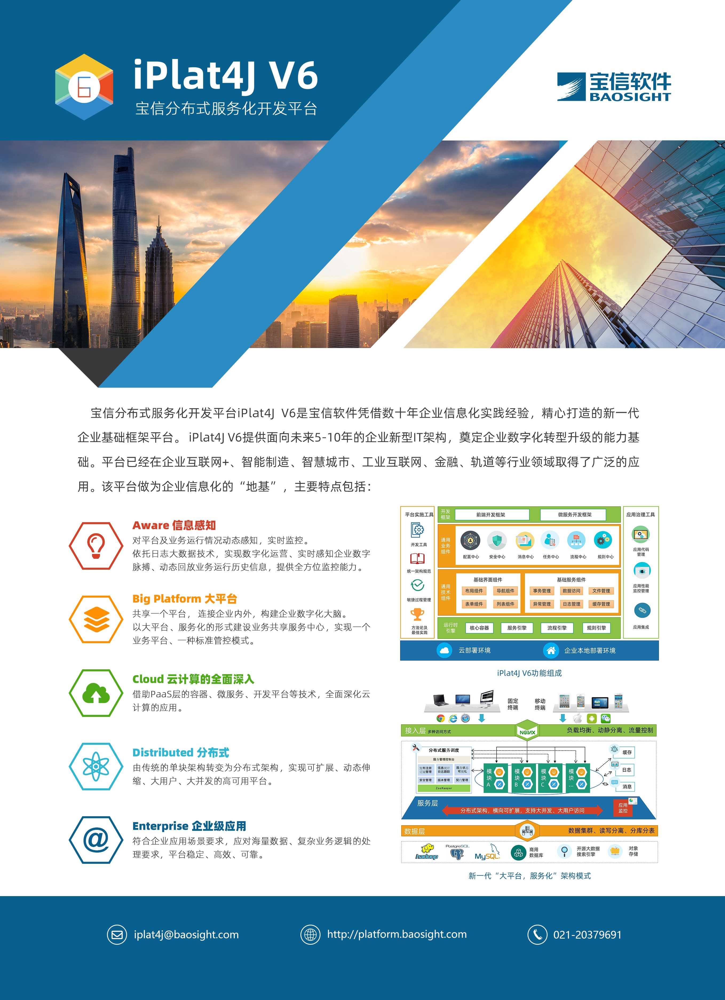

> iPlat4J V6 简介

宝信分布式服务化开发平台iPlat4J V6，是宝信软件凭借数十年企业信息化实践经验，精心打造的新一代企业基础框架平台。该平台做为企业信息化的“地基”，主要特点包括：

    1.按照“大平台、微服务” 的架构模式进行设计 ，采用分布式、微服务、云计算等IT技术，可支撑构建大并发、高性能、高可用、可扩展的分布式应用系统；
    
    2.采用面向服务（SOA）及微服务（MSA）的技术架构模式，具有开放、轻量、解耦的特性，支撑企业搭建服务化或微服务架构，为业务提供灵活、可靠、领先的技术架构；
    
    3.提供前端开发框架和微服务开发框架，以及业务流程管理、企业授权管理、消息管理、任务管理、配置管理等通用业务组件，帮助企业快速构建扁平化、组件化、服务化应用系统；
    
    4.提供开发、测试等开发工具，以及持续集成、监控等运维工具，协助企业实现开发运维一体化和应用开发敏捷迭代；规范开发标准，降低开发门槛，提升开发效率，将码农变成码工，由个体化的农民变成流水线的工人；
    
    5.为企业信息系统设计、开发、运行和维护提供中间层的支撑服务，覆盖企业信息化建设全流程，提供完整的企业信息化解决方案。
    
     iPlat4J V6提供面向未来5-10 年的企业新型IT架构，奠定企业数字化转型升级的能力基础。平台已经在企业互联网+、智能制造、智慧城市、工业互联网、金融、轨道等行业领域取得了广泛的应用。
