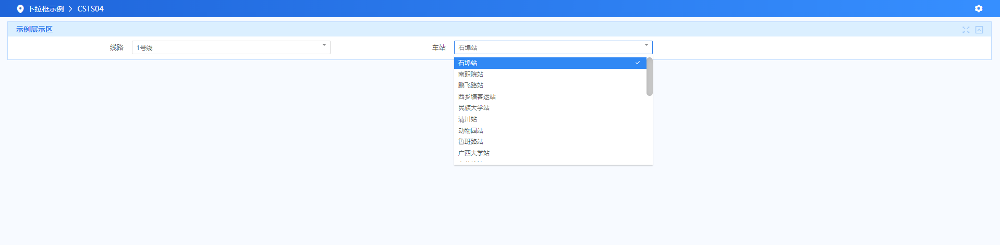

## EFSelect 平台API

- EFSelect属性

详见：[EFSelect UI属性](https://confluence.baocloud.cn/display/iPlatV6Doc/EFSelect)

- EFSelect组件示例

详见：[EEDM5010-级联下拉示例](https://confluence.baocloud.cn/pages/viewpage.action?pageId=10620435)

详见：[EEDM5011-下拉多选示例](https://confluence.baocloud.cn/pages/viewpage.action?pageId=10620437)

详见：[EEDM5012-EFSelect标签与EFOption等标签配合完成下拉相关功能](https://confluence.baocloud.cn/pages/viewpage.action?pageId=10620366)

## EFSelect 初始化

- <span style="color:red;font-size:18px">使用serviceName、methodName初始化数据</span>

> ### EFSelect 初始化效果展示



> ### CSTS04.jsp

```jsp
<!--
@parame ename 
@parame cname 
@parame textField 必选参数，树结点显示值对应的字段名
@parame valueField 树结点的id对应的字段名，点击树结点时，根据id查询子结点
@parame serviceName 必选参数，调用后端Service的服务名
@parame methodName 必选参数，调用后端Service的服务方法名
@parame resultId 
-->
<EF:EFPage title="下拉框示例">
    <EF:EFRegion id="inqu" title="下拉框初始化（serviceName、methodName方式）">
        <EF:EFSelect ename="inqu_status-0-line" cname="线路" textField="LINENAME" valueField="LINEID"
                     serviceName="CSTS04" methodName="queryLine" resultId="result1">
        </EF:EFSelect>
        <EF:EFSelect ename="inqu_status-0-station" cname="车站" textField="STANAME" valueField="STAID"
                     serviceName="CSTS04" methodName="queryStation" resultId="result2">

        </EF:EFSelect>
    </EF:EFRegion>
</EF:EFPage></EF:EFPage>
```

> ### ServiceCSTS04.java

```java
    public EiInfo queryLine(EiInfo eiInfo) {
        List result = dao.query("CSTS04.queryLine", null);
        EiBlock eiBlock = new EiBlock("result1");
        eiBlock.addRows(result);
        eiInfo.setBlock(eiBlock);
        return eiInfo;
    }

    public EiInfo queryStation(EiInfo eiInfo) {
        List result = dao.query("CSTS04.queryStation", null);
        EiBlock eiBlock = new EiBlock("result2");
        eiBlock.addRows(result);
        eiInfo.setBlock(eiBlock);
        return eiInfo;
    }
```
> ### CSTS04.xml

```xml
    <select id="queryLine" resultClass="java.util.HashMap">
        SELECT FD_ID AS lineID,FD_LINE_NAME AS lineName FROM ${oracleSchema}.T_LINE tl
    </select>

    <select id="queryStation" resultClass="java.util.HashMap">
        SELECT FD_ID AS staID,FD_NAME AS staName FROM ${oracleSchema}.T_STATION ts
    </select>
```
