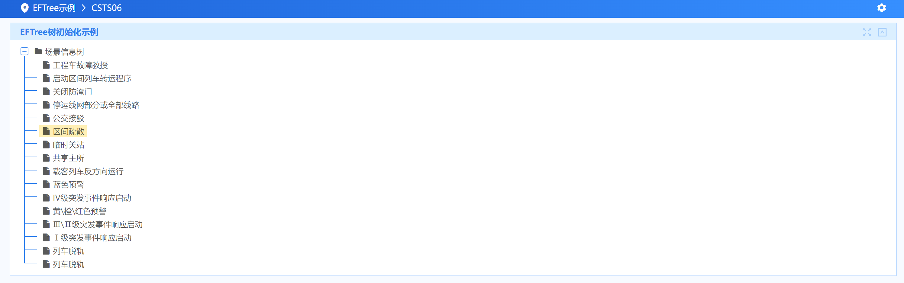

## EFTree 平台API

详见：[EFTree UI属性](https://confluence.baocloud.cn/display/iPlatV6Doc/EFTree)

详见：[EFTree 组件示例](https://confluence.baocloud.cn/pages/viewpage.action?pageId=10620397)

## EFTree 初始化

详见：[EFTree 树组件开发入门](https://confluence.baocloud.cn/pages/viewpage.action?pageId=17148304)

> ### 初始化效果展示



> ### CSTS06.jsp

```jsp
<!--
@parame id 树表组件的唯一标识，js中的可根据此属性配置指定的组件
@parame root 使用JSON格式配置首个节点信息。配置的格式 root="{label: 'xxx', text: 'xxx'}"。 /r/n </br>表示首个节点的初始化信息。其中label为valueField 映射值， text为 textField 映射值（已在js中配置，可不添加）。
@parame textField 必选参数，树结点显示值对应的字段名
@parame valueField 树结点的id对应的字段名，点击树结点时，根据id查询子结点
@parame hasChildren 必选参数，用来指定节点中哪个属性用来表示是否存在子节点。比如hasChildren=“leaf”，就表明leaf属性中的值是用来表示是否存在子节点。另外，由于平台以前版本中是使用1(不存在子节点)和2(存在子节点)两种数据来表示是否存在子节点，本EFTree.tag 是兼容以前平台的服务。所以在调用后端服务时候，开发人员是需要注意返回的数据内容。
@parame dataSpriteCssClassField 可选参数，用来指定节点中那个属性用来表示此节点的图标样式。
@parame serviceName 必选参数，调用后端Service的服务名
@parame methodName 必选参数，调用后端Service的服务方法名
-->
<EF:EFPage title="">
    <EF:EFRegion id="EFTreeDemo1" title="EFTree树初始化示例">
        <EF:EFTree id="tree01" textField="text" valueField="label" hasChildren="leaf"
                   dataSpriteCssClassField="icon" serviceName="CSTS06" methodName="queryTreeNode">
        </EF:EFTree>
    </EF:EFRegion>
</EF:EFPage>
```
> ### CSTS06.js

```javascript
$(function () {
    IPLATUI.EFTree = {
        //树的id
        "tree01": {
            //配置树的根节点
            ROOT: {label: "root", text: "场景信息树", leaf: true, icon: "fa fa-folder"}
        }
    };

});
```

> ### ServiceCSTS06.java

```java
public EiInfo queryTreeNode(EiInfo inInfo) {
        //1 获取参数
        String pEname = inInfo.getCellStr(EiConstant.queryBlock, 0, "node");

        //2 查询节点
        List result = dao.query("CSTS06.queryTreeNode", null);

        //3 增加节点block块
        EiInfo outInfo = new EiInfo();
        EiBlock outBlock = outInfo.addBlock(pEname);
        outBlock.addRows(result);
        return outInfo;
}
```

> ### CSTS06.xml

```xml-dtd
<?xml version="1.0" encoding="UTF-8" ?>
<!DOCTYPE sqlMap PUBLIC "-//iBATIS.com//DTD SQL Map 2.0//EN" "http://www.ibatis.com/dtd/sql-map-2.dtd">
<sqlMap namespace="CSTS06">
    <select id="queryTreeNode" resultClass="java.util.HashMap">
        select
        fd_id as "label",
<!-- 'root' as "pId", -->
        fd_name as "text",
        1 as "leaf",
        'fa fa-file' as "icon"
        from t_scene
    </select>
</sqlMap>
```

## EFTree 节点动态刷新

- #### <span style="color:red;font-size:18px">EFTree树中局部节点如何刷新？</span>

``` jsp
<EF:EFTree bindId="menu" ename="tree_name" textField="text" valueField="label" hasChildren="leaf"
           dataSpriteCssClassField="icon"
           serviceName="EEDM05" methodName="query" style="height:550px;">
</EF:EFTree>
```

这里是用EFTree生成了一棵树 ：


如果我们想对其中一个节点，比如“美洲”下面的数据进行刷新。代码如下：

```javascript
IPLATUI.EFTree = {
    "menu": {
        ROOT: {label: "root", text: "地区分布", leaf: true,icon: "folder"},
        // select事件表示用户选中节点
        select: function (e) {
            var _data = this.dataItem(e.node);
            console.log(_data);
        },
    }
}
  
.......
  
// 获取tree的kendo对象
var menu = $("#menu").data("kendoTreeView");
// 调用kendo中Tree的API获取model对象
// EFTree中“valueField”配置“label”的作为tree中主键，可以通过查询主键获取节点node对象，节点名字为“美洲”的对象它的label值是“America”
var node = menu.dataSource.get("America");
if (node) {
    // 重新设置flag , 这样才能重新使其到服务器获取数据
    node.loaded(false);
    // 重新加载
    node.load();
}
```

