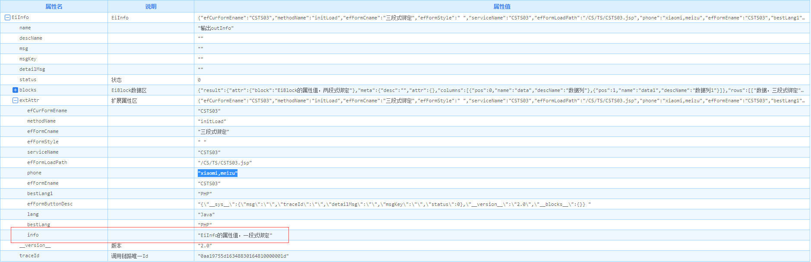

## IPLAT UI组件库
iPlat4J V6 封装的Tag库，基于JSP Tag 2.0的SimpleTag机制，最大程度上兼容3.9 和 V5的原有Tag配置和功能。针对原有设计不足的地方，也做了相应的改进。具体表现在以下几个方面：  
**统一控件的属性配置**  
EiColumn的配置是个经典的例子：

在Java代码中有EiColumn.java文件，定义了相关的属性，例如：name， descName，用来表示字段的名称和显示名称；

在EFColumn Tag中，对应的属性的名称是 ename，cname，用来表示表格中的列的字段名称和显示名称；【iPlat4J V6的Tag支持动态属性配置：[04 Tag中如何使用 attributes 动态属性](https://confluence.baocloud.cn/pages/viewpage.action?pageId=12554876)】

在iPlat4J V6之前的版本，没有在JavaScript中配置组件的属性的机制，iPlat4J V6新增了在JS中配置组件属性的机制，相对于Tag标签封装的属性，JS的原生配置更为灵活有效；

在JavaScript中，列对应的属性名是field， title。

因此，存在一个属性名映射的问题。例如，EFColumn Tag应该新提供field和title属性，废弃原有的ename和cname属性【当前为了兼容考虑，会保留ename和cname，但优先读取filed和title新属性】

现在统一配置的规则:

- **配置的优先级： JS的配置 > EF Tag中的配置 > Java代码中的配置**
- **常用的配置，推荐在EF Tag中直接配置；**
- **EF Tag 无法满足的情况下，再使用JS，不能滥用JS配置；**
- **极度不建议在Java代码中配置属性值；**

 详见：[IPLAT UI组件库](https://confluence.baocloud.cn/pages/viewpage.action?pageId=10617677)

## 控件对象获取

iPlatUI提供的控件包括两大类：

1. 基于KendoUI组件封装的控件；
2. iPlatUI自定义开发的控件；

> 基于KendoUI组件封装的控件

通常基于KendoUI组件封装的控件，可以通过 $("#id").data("kendoGrid")的形式获取。

其中 $("#id")是控件对应的DOM元素。注意：要在控件渲染结束后，才能从data方法中，取得控件的实例对象。

kendo + 控件名称

 

EF Tag组件名称和KendoUI控件名称的对应关系表

| Tag组件名称    | KendoUI控件名称   |
| :------------- | :---------------- |
| EFDatePicker   | kendoDatePicker   |
| EFSelect       | kendoDropDownList |
| EFMultiSelect  | kendoMultiSelect  |
| EFAutoComplete | kendoAutoComplete |
| EFUpload       | kendoUpload       |

## IPLAT相关API
详见：[IPLAT相关API](https://confluence.baocloud.cn/pages/viewpage.action?pageId=17155538)

## EFForm工具类（v3.9）
详见：~~[EFForm工具类](https://confluence.baocloud.cn/pages/viewpage.action?pageId=10623010)~~

## Iplat4j样式修改

本栏目主要针对==4J平台==在项目实践中的UI需求进行扩展。

1.完成多套登录页和首页，可直接在项目中拿来即用。其中一套采用非框架的UI，以适配系统整合需要。

3.提供可定制的皮肤，实现系统一键换肤需要，能适应多种业务场景下的皮肤需求。

3.结合项目中UI需求，提供UI规范建议。

4.总结已有项目的页面布局，为各场景下的项目布局提供示例。

5.结合大屏投屏需要的几套可视化风格样例。

详见：[平台UI样式修改](http://rt.baosight.com/cf/pages/viewpage.action?pageId=2162974)

## 平台Ajax（EiCommunicator）

EiCommunicator 封装前端ajax提交到EiService调用, 它是平台提供的一个前端全局变量。

EiCommunicator 提供三个静态的方法为开发人员调用，分别是send，$send，sendFuncCall。 

这里重点介绍一下EiCommunicator.send这个方法

详见：[EiCommunicator](https://confluence.baocloud.cn/display/iPlatV6Doc/EiCommunicator)

## ajax调用4j微服务方式

详见：[微服务调用](http://rt.baosight.com/cf/pages/viewpage.action?pageId=30048296)

## 服务仿真调用[EUSI01](https://confluence.baocloud.cn/pages/viewpage.action?pageId=25991350)

## iPlatUI-页面通知（NotificationUtil）
详见：[iPlatUI-页面通知信息规范](https://confluence.baocloud.cn/pages/viewpage.action?pageId=12569499)  
详见：[NotificationUtil-通知的简单应用](https://confluence.baocloud.cn/pages/viewpage.action?pageId=12569499)

## 带树页面效果展示
详见：[带树页面效果展示](https://confluence.baocloud.cn/pages/viewpage.action?pageId=17153944)

## 三段式绑定详解
详见：[EFInput数据绑定](https://confluence.baocloud.cn/pages/viewpage.action?pageId=10619871)
- 一段式  从`EiInfo`的`attr`属性区获得数据  
`info` **extAttr**:`info` 
- 二段式  从`EiBlock`属性区对应`blockId`的`attr`属性区获得数据  
`result-block` **blockId**:`result` **extAttr**:`block` 
- 三段式  获得对应`blockId`的对应列名的第`rowNo`行数据  
`result-1-data1` **blockId**:`result` **rowNo**:`1` **cellMeta**:`data1` 

## eiInfo